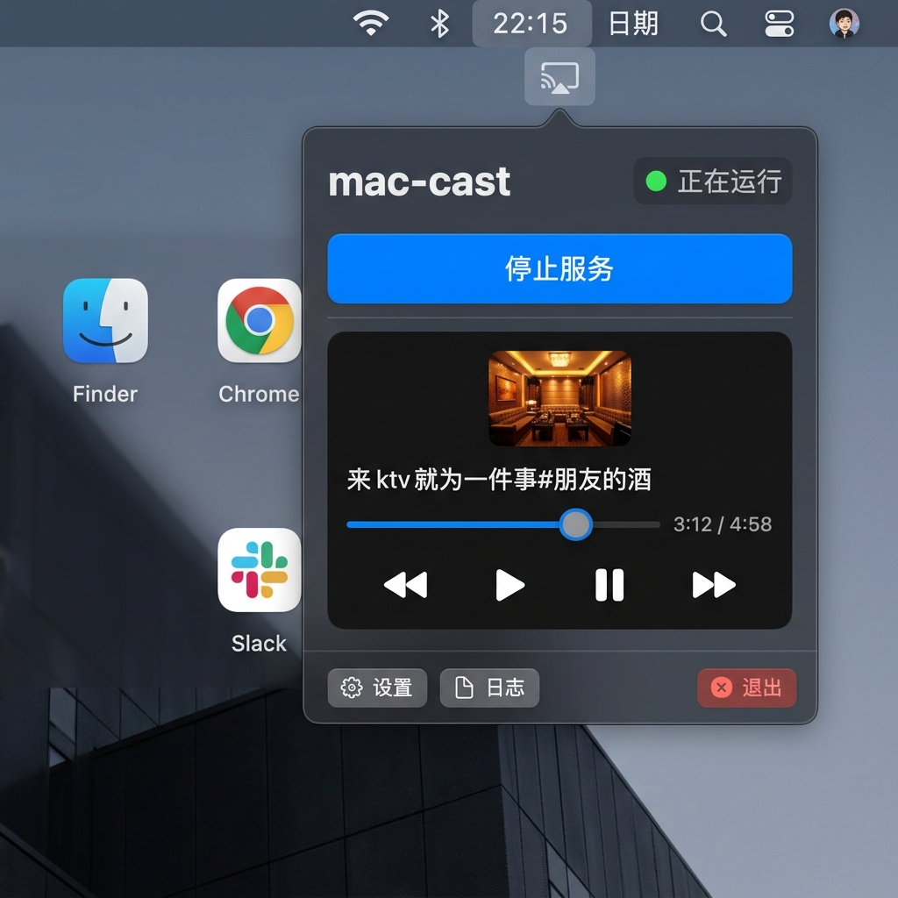
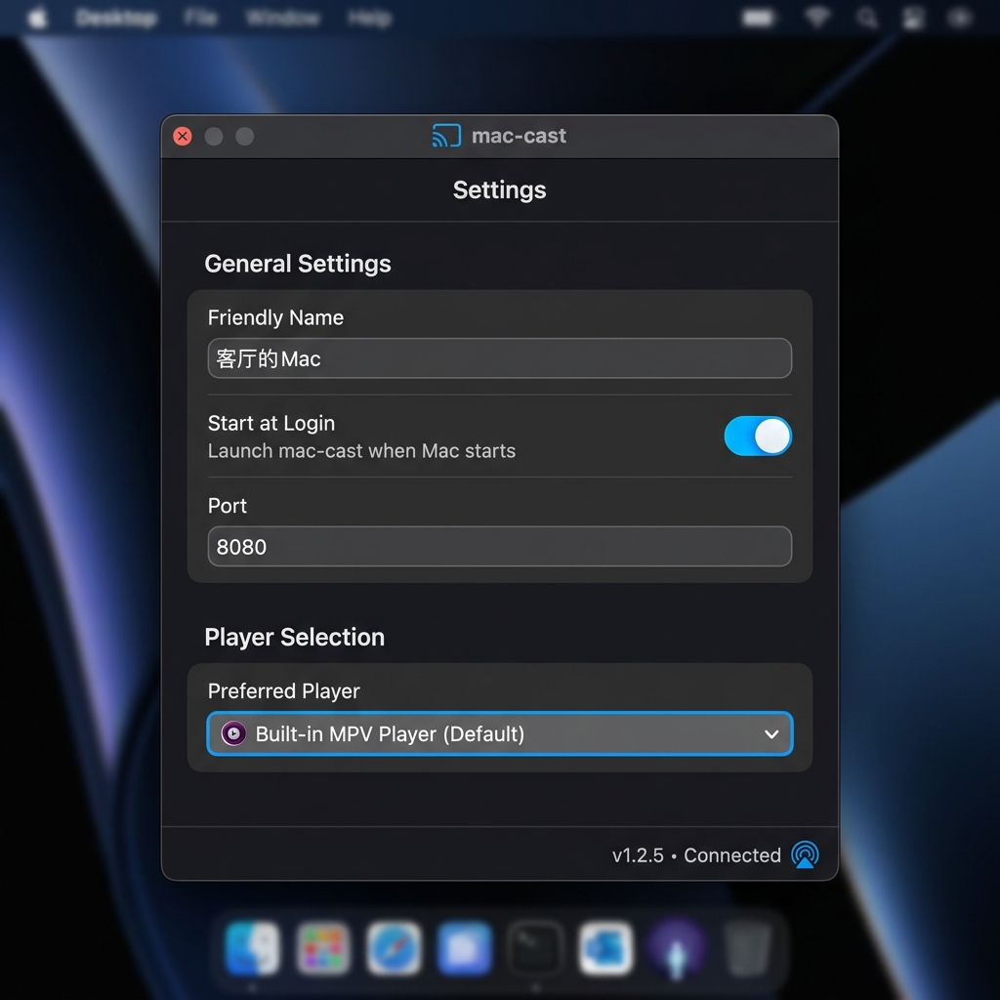
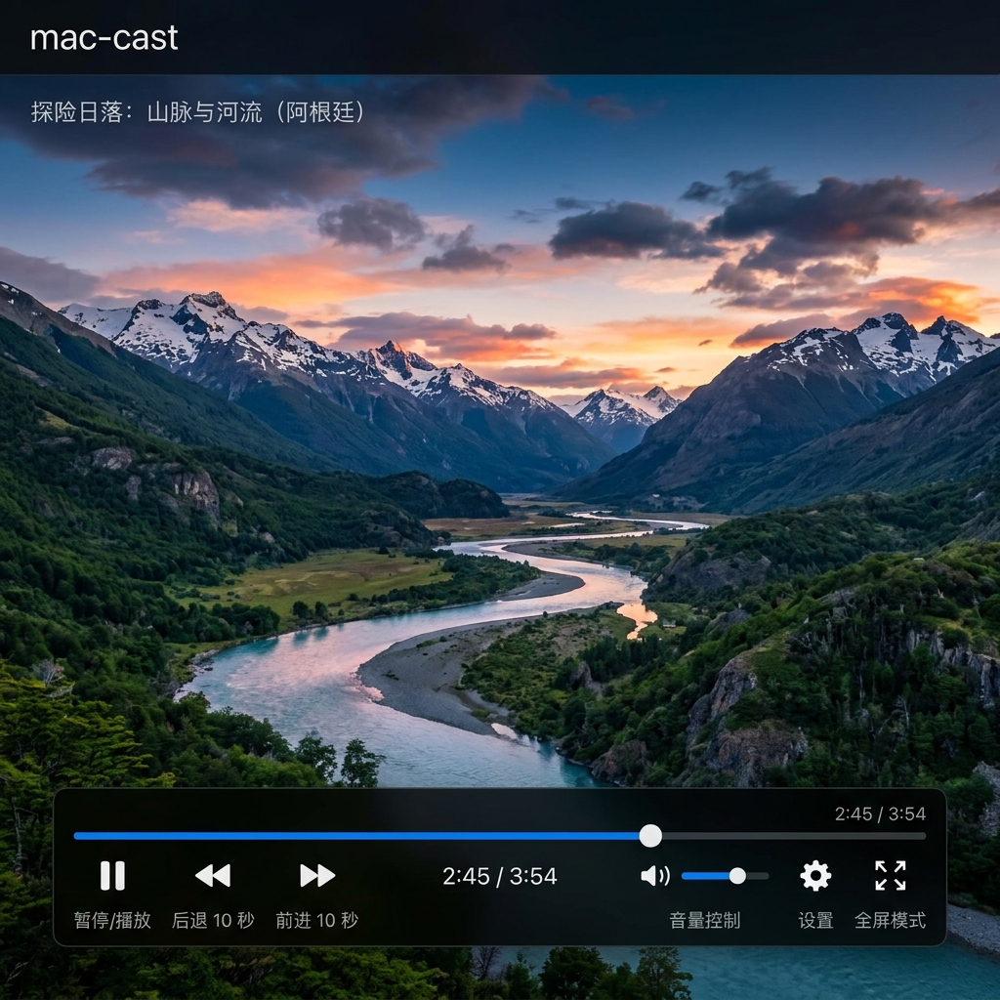

# mac-cast (Macast - anyi11 优化版)

[](https://github.com/anyi11/mac-cast/releases/latest)

[](https://github.com/anyi11/mac-cast/releases/latest)
[](https://github.com/anyi11/mac-cast/releases/latest)

`mac-cast` 是一个专为 macOS 深度优化的 **菜单栏\状态栏** 投屏接收端应用。支持手机端（Bilibili、爱优腾、网易云音乐等）通过 DLNA 协议将视频、音乐、图片投放到电脑端播放。

基于原开源项目进行深度定制，带来极致丝滑、美观、无卡顿的本地化播放体验。

---

## 🌟 核心优化与改动

1. **投屏配置迁移**：将「投屏名称 (Friendly Name)」设置卡片从主状态栏气泡中移除，收纳至「设置」窗口，保持主菜单极简清爽。
2. **全新播放控制器 (ModernZ OSC)**：
   * **超大触控按键**：界面控件尺寸增大 **25%**，高分屏操作更精准。
   * **120Hz 高刷渲染**：支持 ProMotion 自适应刷新率，界面拖拽与消失动画如丝般顺滑。
   * **无感进度条拖拽**：优化拖动逻辑，本地实时计算进度，松开鼠标时发送快进指令，告别拖动卡顿与画面缓冲延迟。
   * **全中文本地化**：播放器工具提示（音量、全屏、静音、后退/快进等）完美中文化。
3. **播放器大小映射修复**：对齐修复「小、中、大、自动、全屏」的配置项，选中「全屏」不再误触发「自动」模式。
4. **日志自动清理**：投屏日志与下载记录在读写时自动截断，最大限制保留最新的 **50 条** 历史记录，解决大日志导致的应用卡顿问题。

---

## 📸 软件界面截图

### 1. 状态栏主菜单与播放控制卡片


### 2. 独立设置窗口 (通用设置与播放器配置)


### 3. 全新中文化 ModernZ 播放器控制面板


---

## 📥 下载与安装

1. **直接下载安装包**：  
   点击前往 [mac-cast GitHub Releases](https://github.com/anyi11/mac-cast/releases/latest) 下载最新的 `mac-cast.dmg` 或 `Macast.app`，直接拖入「应用程序 (Applications)」即可运行。

2. **自源码构建**：
   运行根目录下脚本：
   ```shell
   bash build_app.sh
   ```
   构建完成后即可在根目录下得到 `Macast.app`。
